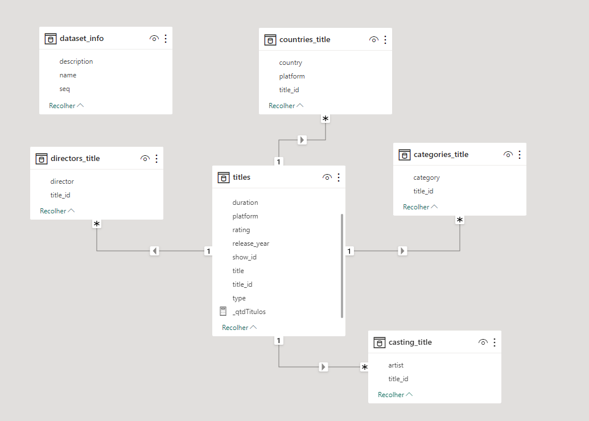
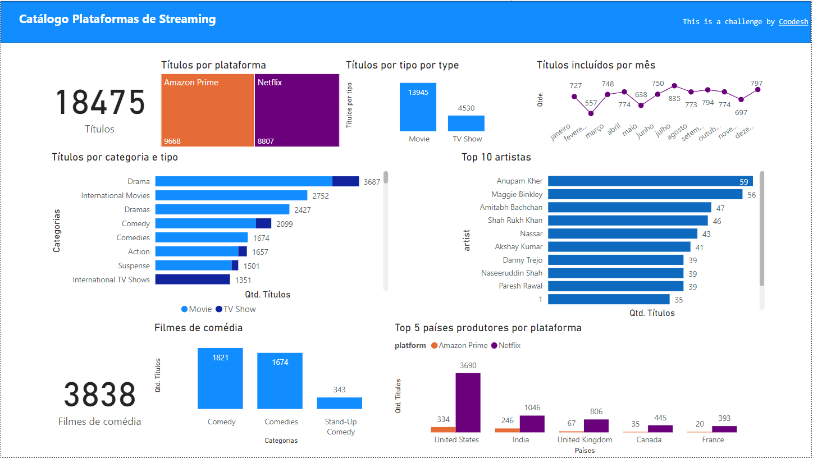

>  This is a challenge by [Coodesh](https://coodesh.com/)
# Data Challenge Coodesh - Plataformas de streaming
Desafio técnico proposto pela Coodesh para avaliação das competências para Data Engineer

# Objetivo
O desafio tem como gerar um dataset unificado com dados das plataformas de streaming Netflix e Amazon Prime,
podendo esta base ser utilizada para realização de análises e geração de insides para responder questões de negócio.

### Stack
* Python
* Pandas
* MatplotLib
* Jupyter Notebooks
* Power BI

## Etapas para desenvolimento da solução
1. Análise e processamento dos dados originais
   * Validação da documentação
   * Higienização dos dados
   * Validação de duplicidades
   * Modelagem dos dados em modelo relacional
   * Extração e transformação de dados
   * Geração da base unificada de streaming preservando o identificador único e identificando a plataforma
3. Análise dos dados da base unificada para extração de informações
4. Criação de dashboard para visulização e iteração com os dados

## Instruções de uso do projeto
* Copie o conteúdo deste repositório, usando <code>git clone</code> ou baixando o *.zip do projeto
* Instale as bibliotecas Python do projeto, presentes no arquivo <code>requirements.txt</code>
Comando: <code>pip install -r requirements.txt</code>
* Execute o Jupyter Lab para iniciar o servidor para executar os notebooks.
Comando: <code>jupyter lab</code>
* Deve ser executado o notebook <code>[01_processamento_dados.ipynb](01_processamento_dados.ipynb)</code> primeiro e
depois o <code>[01_processamento_dados.ipynb](01_processamento_dados.ipynb)</code>.
* Após a execução do processamento, abra o projeto do dashboard (<code>[dashboard.pbix](dashboard.pbix)</code>) no Power BI e atualize a referência das fontes de dados para os arquivos gerados no diretório <code>/analytics</code>.

## Estrutura do projeto
* diretório <code>/data</code> contém os datasets dos títulos das plataformas e as informações sobre os dados
* diretório <code>/analytics</code> contém os datasets gerados a partir do processamento dos datasets 
dos títulos das plataformas
* Arquivo <code>[01_processamento_dados.ipynb](01_processamento_dados.ipynb)</code> é notebook responsável por realizar a etapa de análise e processamento dos dados pra gerar os
os datasets finais para as análises.
* Arquivo <code>[02_analise_dados.ipynb](02_analise_dados.ipynb)</code> é notebook contém as análises realizadas para responder as questões de negócio
* Arquivo <code>[dashboard.pbix](dashboard.pbix)</code> é dashboard criado no Power BI para realização de análises interativas 
dos dados gerados pelo processamento.

### Diagrama de Entidade e Relacionamento
Este é o modelo de dados definido com base na análise dos dados originais.
Após o processamento dos arquivos de  cada plataforma, foram gerados novos arquivos *.csv
que representam este modelo que pode ser reproduzido em um banco de dados relacional se for necessário.

MER Desafio Coodesh

### Dashboard catálogo das plataformas de streaming

Dashboard Power Bi

